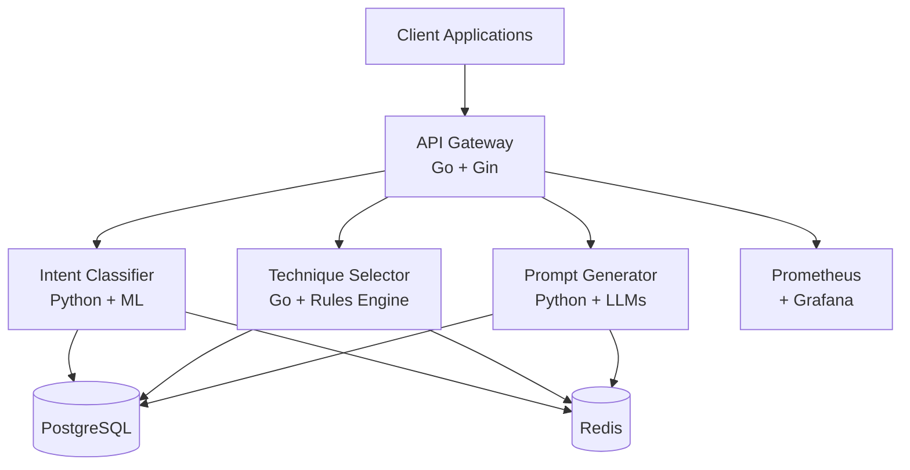

# 🚀 BetterPrompts API

<div align="center">


[](LICENSE)
[](docker-compose.yml)
[](https://golang.org/)
[](https://www.python.org/)

**Transform any prompt into an AI-optimized version through a powerful REST API**

[📖 API Documentation](./API_USAGE.md) • [🚀 Quick Start](#-quick-start) • [💡 Examples](./examples/) • [🐛 Issues](https://github.com/CodeBlackwell/BetterPrompts/issues)

</div>

---

## 🎯 Overview

BetterPrompts is a sophisticated prompt engineering API that automatically enhances user inputs using advanced techniques like Chain of Thought, Few-Shot Learning, and Tree of Thoughts. Built with a microservices architecture, it delivers enterprise-grade performance while maintaining simplicity.

### Why BetterPrompts?

- **🧠 12+ Prompt Engineering Techniques** - Automatically applied based on intent analysis
- **⚡ Lightning Fast** - <200ms response time with intelligent caching
- **🔧 Simple Integration** - RESTful API works with any programming language
- **📈 Production Ready** - Built for scale with monitoring, rate limiting, and 99.9% uptime
- **🔒 Enterprise Security** - JWT auth, API keys, rate limiting, and input validation

---

## 🚀 Quick Start

Get up and running in under 5 minutes:

```bash
# 1. Clone the repository
git clone https://github.com/CodeBlackwell/BetterPrompts.git
cd BetterPrompts

# 2. Set up environment
cp .env.example .env
# Edit .env and add your OPENAI_API_KEY or ANTHROPIC_API_KEY

# 3. Start the services
docker compose up -d

# 4. Test the API
curl -X POST http://localhost/api/v1/enhance \
  -H "Content-Type: application/json" \
  -d '{"text": "Explain quantum computing"}'
```

That's it! Your prompt enhancement API is now running at `http://localhost/api/v1`

---

## 📡 API Overview

### Core Enhancement Endpoint

**POST** `/api/v1/enhance`

```json
{
  "text": "Help me understand machine learning",
  "prefer_techniques": ["step_by_step", "analogical"],
  "context": {
    "audience": "beginner",
    "domain": "education"
  }
}
```

**Response:**
```json
{
  "id": "550e8400-e29b-41d4-a716",
  "original_text": "Help me understand machine learning",
  "enhanced_text": "I'll explain machine learning step-by-step using simple analogies...",
  "techniques_used": ["step_by_step", "analogical", "structured_output"],
  "intent": "education",
  "confidence": 0.95,
  "processing_time_ms": 187
}
```

### Available Endpoints

| Endpoint | Method | Description | Auth |
|----------|--------|-------------|------|
| `/api/v1/enhance` | POST | Enhance a prompt with AI techniques | Optional |
| `/api/v1/analyze` | POST | Analyze prompt intent without enhancement | Optional |
| `/api/v1/techniques` | GET | List all available techniques | No |
| `/api/v1/history` | GET | Get your enhancement history | Required |
| `/api/v1/feedback` | POST | Submit feedback on enhancements | Required |

[📖 Full API Documentation](./API_USAGE.md)

---

## 💡 Usage Examples

### Python
```python
import requests

response = requests.post(
    "http://localhost/api/v1/enhance",
    json={"text": "Create a marketing strategy for a startup"}
)
enhanced = response.json()
print(enhanced["enhanced_text"])
```

### JavaScript
```javascript
const result = await fetch('http://localhost/api/v1/enhance', {
  method: 'POST',
  headers: { 'Content-Type': 'application/json' },
  body: JSON.stringify({
    text: 'Debug this code error',
    context: { language: 'python' }
  })
}).then(r => r.json());
```

### cURL
```bash
curl -X POST http://localhost/api/v1/enhance \
  -H "Content-Type: application/json" \
  -d '{"text": "Write unit tests for a REST API"}'
```

[More examples →](./examples/)

---

## 🏗️ Architecture

<div align="center">



</div>

### Tech Stack

- **Backend Services**: Go (Gin) + Python (FastAPI)
- **ML/AI**: PyTorch, Transformers, DeBERTa-v3
- **Databases**: PostgreSQL 16, Redis 7
- **Infrastructure**: Docker, Kubernetes-ready
- **Monitoring**: Prometheus + Grafana
- **LLM Providers**: OpenAI, Anthropic

---

## 🔧 Prompt Engineering Techniques

Our API intelligently selects and applies techniques based on your prompt:

| Technique | Best For | Example Use Case |
|-----------|----------|------------------|
| **Chain of Thought** | Complex reasoning | Problem solving, analysis |
| **Few-Shot Learning** | Pattern matching | Code generation, formatting |
| **Step-by-Step** | Educational content | Tutorials, explanations |
| **Tree of Thoughts** | Decision making | Strategy, planning |
| **Role Playing** | Creative tasks | Writing, brainstorming |
| **Structured Output** | Data organization | Reports, summaries |
| **Analogical Reasoning** | Concept explanation | Teaching complex topics |
| **Constraint Setting** | Focused results | Specific requirements |
| **Meta Prompting** | Self-improvement | Prompt optimization |
| **Emotional Appeals** | Persuasive content | Marketing, storytelling |
| **Socratic Method** | Critical thinking | Education, coaching |
| **Recursive Refinement** | Quality improvement | Writing, code review |

---

## ⚙️ Configuration

### Essential Environment Variables

```bash
# LLM Providers (at least one required)
OPENAI_API_KEY=sk-...
ANTHROPIC_API_KEY=sk-ant-...

# Security
JWT_SECRET=your-secret-key
API_KEY_ENABLED=false  # Set to true for API key auth

# Performance
RATE_LIMIT_REQUESTS_PER_MINUTE=60
CACHE_TTL=3600
```

### Production Deployment

```bash
# Using Docker Compose
docker compose -f docker-compose.prod.yml up -d

# Using Kubernetes
kubectl apply -f k8s/

# Cloud Deployments
# - AWS ECS/EKS
# - Google Cloud Run
# - Azure Container Instances
# - Heroku Container Registry
```

---

## 📊 Performance & Monitoring

- **Response Time**: p95 < 200ms
- **Throughput**: 1000+ requests/second
- **Availability**: 99.9% uptime SLA
- **Caching**: Intelligent caching with Redis
- **Metrics**: Prometheus endpoint at `/metrics`
- **Dashboards**: Pre-configured Grafana dashboards

---

## 🔒 Security Features

- **Authentication**: JWT tokens or API keys
- **Rate Limiting**: Configurable per IP/user
- **Input Validation**: Strict validation and sanitization
- **HTTPS**: TLS support for production
- **CORS**: Configurable cross-origin policies
- **Audit Logging**: Complete request/response logging

---

## 🧪 Testing

```bash
# Run all tests
docker compose -f docker-compose.test.yml up

# Unit tests
cd backend/services/api-gateway && go test ./...

# Integration tests
python tests/integration/test_api.py

# Load testing
k6 run tests/performance/load_test.js
```

---

## 🤝 Contributing

We welcome contributions! See our [Contributing Guide](CONTRIBUTING.md) for details.

### Development Setup

```bash
# Backend services
cd backend/services/api-gateway && go run main.go
cd backend/services/intent-classifier && uvicorn app.main:app --reload

# With hot reload
docker compose -f docker-compose.dev.yml up
```

---

## 📚 Resources

- [API Documentation](./API_USAGE.md) - Complete API reference
- [Architecture Guide](./docs/ARCHITECTURE.md) - System design details
- [Deployment Guide](./docs/DEPLOYMENT.md) - Production deployment
- [Client Examples](./examples/) - Python, JS, Go, Java examples
- [Troubleshooting](./docs/TROUBLESHOOTING.md) - Common issues

---

## 📄 License

This project is licensed under the MIT License - see the [LICENSE](LICENSE) file for details.

---

<div align="center">

### 🌟 Show Your Support

If you find BetterPrompts useful, please consider giving it a star!

[](https://github.com/CodeBlackwell/BetterPrompts/stargazers)

**Built with ❤️ by the BetterPrompts Team**

[Website](https://betterprompts.ai) • [Twitter](https://twitter.com/betterprompts) • [Discord](https://discord.gg/betterprompts)

</div>